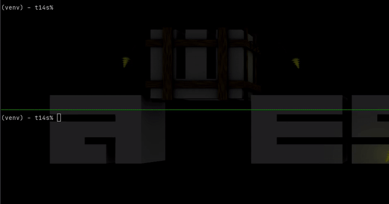

# `ptyrc` – the pty remote controller

This started as a wrapper around
[`pty`](https://docs.python.org/fr/3/library/pty.html) which grew until it
walked on its own.

The initial goal was to wrap a CLI application like [`vim`](https://vim.org) to
add confetti to its output.



# Quick setup

This is not yet published on [PyPI](https://pypi.org):

```sh
python3 -m venv venv
source venv/bin/activate
pip install git+https://github.com/plcp/ptyrc.git@main
```

Wrap any application with a `ptyrc` driver as follows:
```sh
ptyrc-driver vim ~/.vimrc
```

You can then connect to the driver as follows:
```sh
ptyrc-pilot # (by default, run an interactive session)
```

This is an example of an interactive session with the pilot:
```sh
Connected to "/usr/bin/vim /home/plcp/.vimrc"
>>> pilot.argv
['/usr/bin/vim', '/home/plcp/.vimrc']
>>> pilot.size
[103, 13]
>>> pilot.cursor
[17, 5]
>>> pilot.input(pilot.key.ARROW_UP * 4 + pilot.key.ARROW_LEFT * 16)
>>> pilot.cursor
[1, 1]
>>> pilot.input(pilot.key.ESC + 'o' + 'hello world!')
>>> pilot.text_at(pilot.cursor_row)
'hello world!'
>>> pilot.input(pilot.key.ESC + 'dd')
>>> pilot.input(':q!' + pilot.key.ENTER)
>>> pilot.connected
False
>>> pilot.quit()
```

You can also use `ptyrc` to display the remote application:
```python
>>> pilot.show()  # show remote terminal as text (^C to exit)
>>> pilot.interact()  # interact with remote terminal (^X to exit)
```

Long term goal is to add everything to manipulate the wrapped CLI, just as
[selenium](https://pypi.org/project/selenium/) manipulates browsers.

# Usage

This whole project has no tests and no documentation.

YMMV :)

